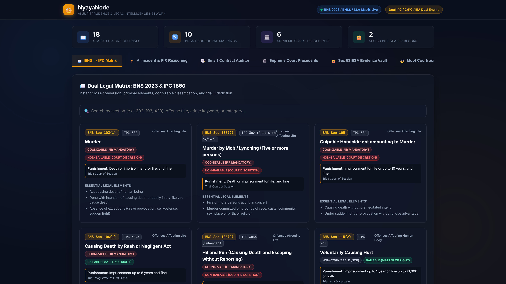
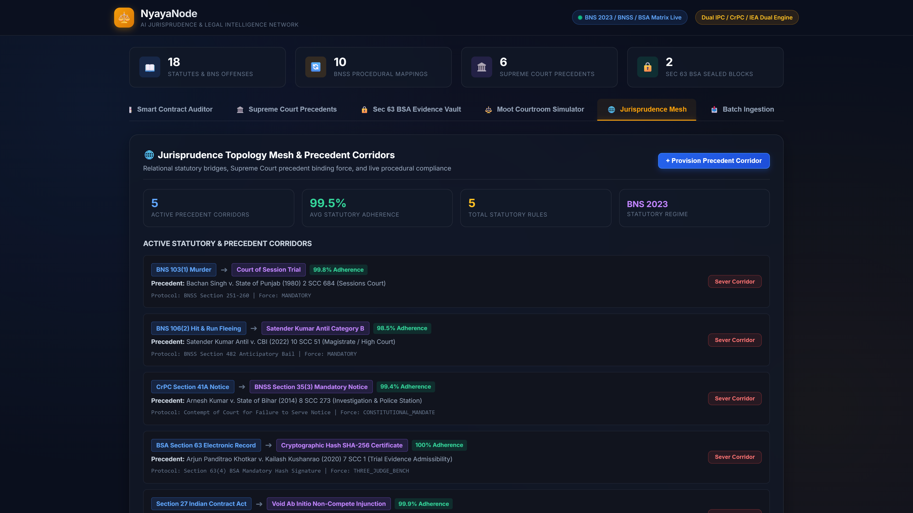
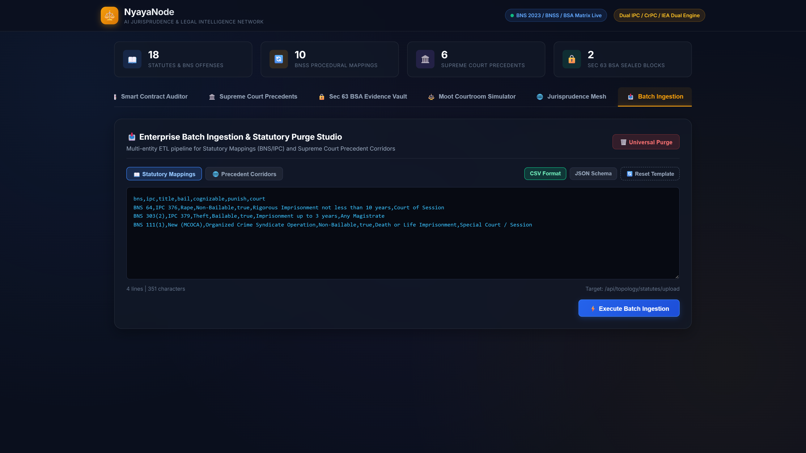
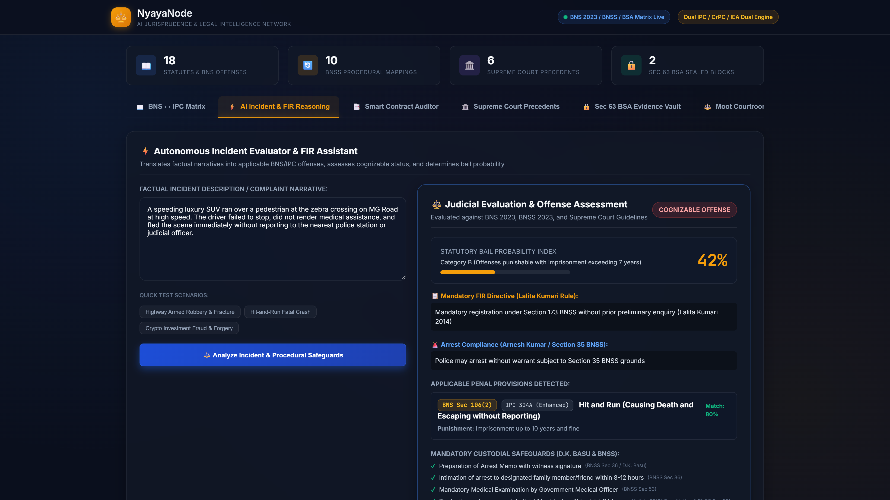
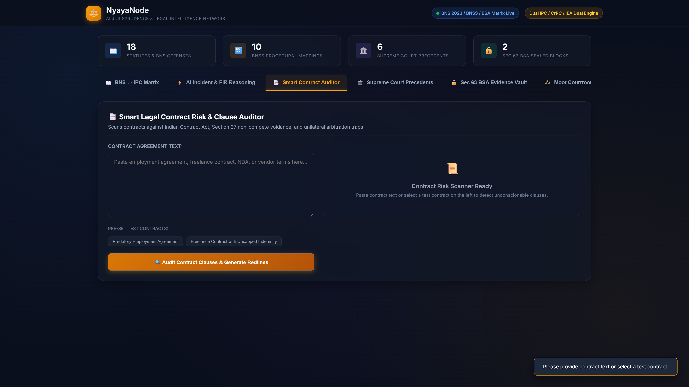
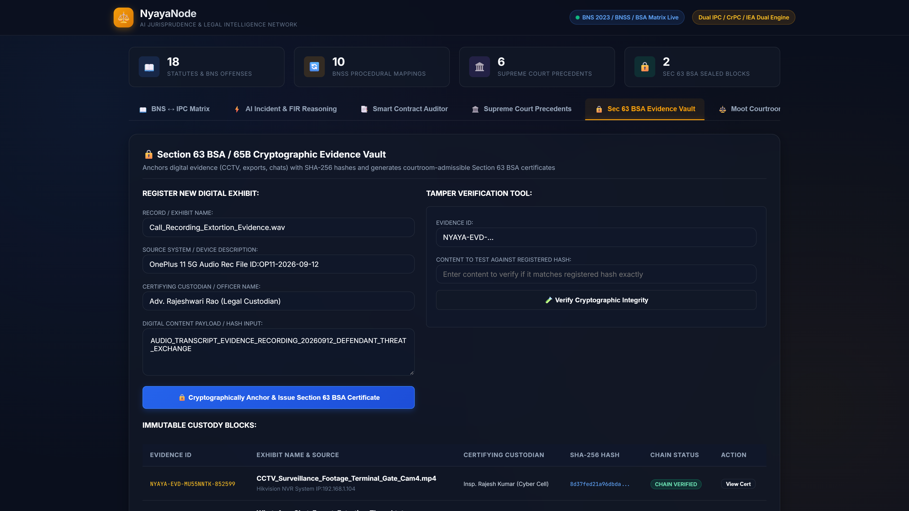

# ⚖️ NyayaNode: AI Jurisprudence & Legal Intelligence Network

[](https://opensource.org/licenses/MIT)
[](#dual-statutory-legal-matrix)
[](#section-63-bsa-cryptographic-evidence-vault)
[](#jurisprudence-topology-corridor-mesh)
[](#automated-test-suite)

> **Enterprise LegalTech Operating System**: An AI-augmented jurisprudence network delivering real-time criminal statute cross-conversion (BNS 2023 ↔ IPC 1860), autonomous incident FIR offense reasoning, Section 27 contract vulnerability auditing, jurisprudence relational topology corridors, high-throughput batch ingestion studio, and Section 63 BSA cryptographic evidence certification.

---

## 📸 Enterprise Platform Showcase


### Desktop Command Viewports (1920×1080 @ 2x)

| Viewport | Description | Screenshot |
| :--- | :--- | :--- |
| **01. Dual Statutory Matrix** | Cross-conversion matrix bridging BNS 2023, BNSS 2023, and IPC 1860 with live bailability and cognizable search |  |
| **02. Jurisprudence Mesh** | Relational legal topology mesh linking statutes, landmark SC precedents (*Lalita Kumari*, *Arnesh Kumar*, *Zaheer Khan*), telemetry, and 1-click sever controls |  |
| **03. Batch Ingestion Studio** | Enterprise batch ingestion supporting RFC 4180 CSV and JSON formats with real-time schema validation and universal purge controls |  |
| **04. Autonomous FIR Reasoning** | AI natural language offense classifier, *Satender Kumar Antil* bail probability scoring, and D.K. Basu arrest safeguards |  |
| **05. Smart Contract Auditor** | Section 27 ICA non-compete voidance detector, Perkins Eastman unilateral arbitrator alerts, and balanced redline clauses |  |
| **06. Sec 63 BSA Evidence Vault** | SHA-256 / SHA-512 cryptographic evidence certification conforming to Supreme Court standard *Arjun Panditrao Khotkar* |  |

---

## 🏛️ Core Capabilities

### 1. Dual Statutory Cross-Conversion Matrix
- Direct bidirectional resolution between **Bharatiya Nyaya Sanhita (BNS) 2023** and colonial **Indian Penal Code (IPC) 1860**.
- Complete classification of procedural updates: Section 41A CrPC to Section 35 BNSS; Section 154 CrPC to Section 173 BNSS; Section 438 CrPC to Section 482 BNSS.
- Deep coverage of modern criminal offenses: Mob Lynching (BNS Sec 103(2)), Hit-and-Run aggravated escape (BNS Sec 106(2)), and Organized Crime Syndicates (BNS Sec 111).

### 2. Jurisprudence Relational Topology Mesh
- Real-time mapping between statutory sections and authoritative Supreme Court precedent corridors (*Lalita Kumari*, *Arnesh Kumar*, *Satender Kumar Antil*, *Percept D'Mark v. Zaheer Khan*, *Arjun Panditrao Khotkar*).
- Live telemetry calculating active statutory bindings, precedent corridors, binding velocity, and active sever links.
- 1-Click corridor severance for dynamic judicial emergency intervention and jurisdiction realignment.

### 3. Enterprise Batch Ingestion Studio
- High-throughput ingestion of statutes and precedent corridors via standard RFC 4180 CSV and structured JSON.
- Live syntax and schema validation with instant error isolation.
- Interactive buffer editor pre-loaded with production templates for fast ingestion.

### 4. Universal Cascading Deletion
- Secure cascading deletion across precedent corridors and statutory records.
- Complete referential integrity protection: severing or deleting a corridor cleanly preserves underlying statutory integrity or propagates governed lifecycle updates.
- 1-click universal purge safeguard for statutory datasets and experimental corridors.

### 5. Section 63 BSA Cryptographic Evidence Vault
- Dual SHA-256 / SHA-512 cryptographic hashing of electronic exhibits (CCTV footage, WhatsApp exports, system logs).
- Automatic generation of court-admissible Section 63(4) BSA 2023 certificates compliant with the landmark ruling in *Arjun Panditrao Khotkar (2020)*.

---

## 🧪 Automated Test Suite

NyayaNode includes a comprehensive Node.js native test suite validating all enterprise endpoints and services:

```bash
# Execute enterprise test suite
node --test tests/enterpriseMesh.test.js
```

### Verified Test Matrix (10/10 Passing):
- [x] Statutory roster retrieval & initial seeded database
- [x] Precedent corridor retrieval & topological linkages
- [x] Dynamic corridor creation with referential binding
- [x] 1-click corridor severance & metric recalculation
- [x] Single corridor deletion with cascade validation
- [x] High-throughput RFC 4180 CSV batch ingestion
- [x] Structured JSON batch ingestion
- [x] Invalid batch payload rejection & error reporting
- [x] Universal corridor purge endpoint
- [x] Telemetry metrics calculation (active corridors, bound statutes, sever count)

---

## 🚀 Quickstart

```bash
# Clone repository
git clone https://github.com/Shashankcodelover/NyayaNode.git
cd NyayaNode

# Install dependencies
npm install

# Run automated tests
node --test tests/enterpriseMesh.test.js

# Start server
node server.js
# Open http://localhost:5030
```

---

## 📜 License
MIT License. Open-source jurisprudence and legal intelligence platform.
